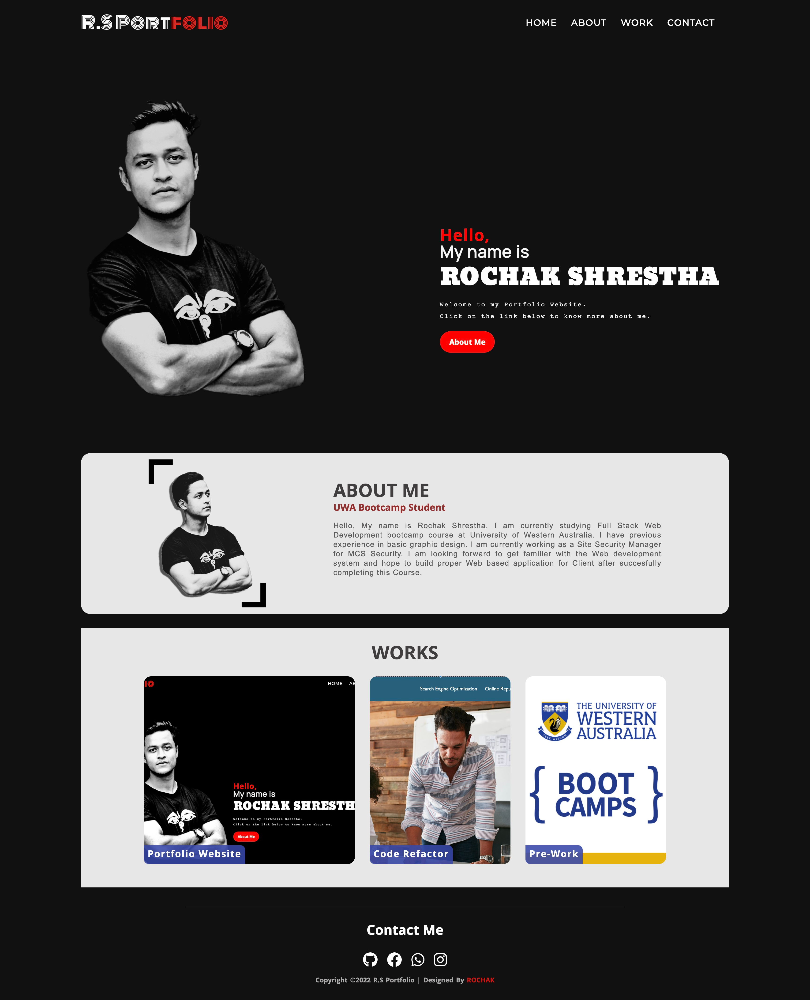

# 02 Advanced CSS: Portfolio

## Description:

This Week 2 bootcamp challenge. This Portfolio page is made from scratch using HTML and CSS code. Following guideline show be met to make this project more accessible:

- Application's links all function correctly.
- Application's CSS selectors and properties are consolidated and organized to follow semantic structure.
- Application's CSS file is properly commented.
- Application deployed at live URL.
- Application loads with no errors.
- Application GitHub URL submitted.
- GitHub repository contains application code.
- Application resembles mock-up provided in the Challenge instructions (at least 90%).
- Repository has a unique name.
- Repository follows best practices for file structure and naming conventions.
- Repository follows best practices for class/id naming conventions, indentation, quality comments, etc.
- Repository contains multiple descriptive commit messages
- Repository contains quality README file with description, screenshot, and link to deployed application.

## Links
Below is the link related to the project:
- Project Homepage: https://rochak-ms.github.io/bootcamp-week2-challenge/
- Repository: https://github.com/rochak-ms/bootcamp-week2-challenge

# Final result

## Portfolio Feature

> **Note**: This website features are as follows:
>
> - A Navigation bar with a Logo Text
>
> - A responsive Into Sectio with Profile Picture
>
> - A Work section with a link to the respected work
>
> - A footer section with the contact and copyright section

## Installation

"N/A"

## Usage

To use this Website, you can review the codes in each section. For looking what changes is being made, open the Chrome DevTools by pressing Command+Option+I (macOS) or Control+Shift+I (Windows). A console panel should open either below or to the side of the webpage in the browser. There you will see comment have been added with the changes being made.

## Credits

- FontAwesome - https://fontawesome.com/kits/bfc7a5d487/use?welcome=yes
- Google Fonts - https://fonts.google.com/

## License

- MIT License
